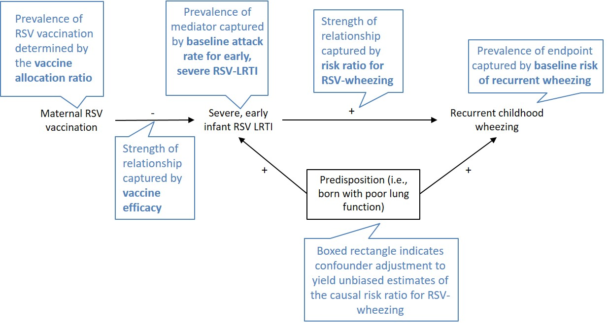

```{r load-libraries-and-data, echo=F, warning=F, message=F}
library(tidyverse)
library(DT)
library(scales)

scenarios <- readr::read_csv(file = "../Data/scenarios.csv")
```

**Authors:** Riddell CA, Bhat N, Bont LJ, Dupont WD, Feikin DR, Fell DB, Gebretsadik T, Hartert TV, Hutcheon JA, Karron RA, Nair H, Reiner RC, Shi T, Sly PD, Stein RT, Wu P, Zar HJ, Ortiz JR for the WHO Technical Working Group on Respiratory Syncytial Virus Vaccination During Pregnancy to Prevent Recurrent Childhood Wheezing

**AUTHOR AFFILIATIONS:**

**Corinne A Riddell, PhD**

Department of Epidemiology, Biostatistics, and Occupational Health, McGill University

Room 27, 1020 Pine Avenue West

Montreal, Quebec, Canada, H3A 1A2


**Niranjan Bhat, MD**

Center for Vaccine Innovation and Access

PATH

2201 Westlake Ave

Seattle, Washington, USA


**Louis J Bont, MD**

Department of Paediatrics, Wilhelmina Children's Hospital, University Medical Centre Utrecht, Lundlaan 6, Utrecht, The 

Netherlands 

The ReSViNET Foundation, 

Zeist, The Netherlands


**William D Dupont, PhD**

Department of Biostatistics

Vanderbilt University School of Medicine

Suite 1100 -- Room 11119

2525 West End Ave.

Nashville, TN 37203-1741, USA


**Daniel R Feikin, MD**

Initiative for Vaccine Research

World Health Organization

20 Avenue Appia

Geneva, Switzerland


**Deshayne B Fell, PhD**

School of Epidemiology and Public Health, University of Ottawa 

Children's Hospital of Eastern Ontario (CHEO) Research Institute

401 Smyth Road, CPCR, Room L-1154

Ottawa, Ontario, Canada K1H 8L1


**Tebeb Gebretsadik, MPH**

Center for Asthma Research

Vanderbilt University School of Medicine

Department of Biostatistics

2525 West End Ave, Suite 11000

Nashville, Tennessee, 37203 USA


**Tina V Hartert, MD**

Center for Asthma Research

Allergy, Pulmonary & Critical Care Medicine

Vanderbilt University School of Medicine

2525 West End Ave, Suite 450

Nashville, Tennessee, 37203 USA

 
**Jennifer A Hutcheon, PhD**

Department of Obstetrics & Gynaecology

University of British Columbia

Shaughnessy C408A, British Columbia Children's & Women's Hospital 

4500 Oak Street

Vancouver, British Columbia, V6H 3N1, Canada


**Ruth A Karron, MD**

Center for Immunization Research

Johns Hopkins University

624 N. Broadway, Suite 217

Baltimore, Maryland, 21205, USA


**Harish Nair, PhD**

Centre for Global Health Research

Usher Institute of Population Health Sciences and Informatics

University of Edinburgh

Medical School, Teviot Place 

Edinburgh, EH8 9AG

Scotland, United Kingdom


**Robert C Reiner, Jr, PhD**

Department of Global Health

University of Washington

2301 5th Ave

Suite 600

Seattle, Washington, 98102, USA


**Ting Shi, PhD**

Centre for Global Health Research

Usher Institute of Population Health Sciences and Informatics

University of Edinburgh

Medical School, Teviot Place

Edinburgh, EH8 9AG

Scotland, United Kingdom


**Peter D Sly, MD**

Child Health Research Centre

University of Queensland

62 Graham St.

South Brisbane, Qld 4101, Australia


**Renato T Stein, MD**

Pediatric Pulmonary Unit

Pontificia Univeridade Católica RS

Av. Ipiranga, 6690/420Porto Alegre, Brazil


**Pingsheng Wu, PhD**

Division of Allergy, Pulmonary, and Critical Care Medicine

Vanderbilt University Medical Center

2525 West End Ave, Suite 1130

Nashville, Tennessee, USA


**Heather J Zar, PhD**

Department of Paediatrics and Child Health

Red Cross War Memorial Children's Hospital

Cape Town, South Africa

SA-Medical Research Council Unit on Child and Adolescent Health

University of Cape Town

5th floor ICH Building, Klipfontein Road

Cape Town, South Africa


**Justin R Ortiz, MD**

Center for Vaccine Development

University of Maryland School of Medicine

685 W. Baltimore St, Suite 480

Baltimore, Maryland, USA


**CORRESPONDING AUTHOR:** Justin R. Ortiz, Center for Vaccine Development, University of Maryland School of Medicine, 685 W. Baltimore Street, Room 480, Baltimore, MD 21201, USA; Phone: +1 (410) 706-3502; Fax: +1 (410) 706-6205; Email: jortiz@som.umaryland.edu

**CONTRIBUTIONS:** JRO conceived of the study. CAR and JRO designed the study. CAR, NB, LJB, WDD, DRF, DBF, TG, TVH, JAH, RAK, HN, RCR, TS, PDS, RTS, PW, HJZ, and JRO reviewed model inputs. CAR performed the statistical analyses. CAR and JRO drafted the manuscript. CAR, NB, LJB, WDD, DRF, DBF, TG, TVH, JAH, RAK, HN, RCR, TS, PDS, RTS, PW, HJZ, and JRO critically revised the manuscript. All authors had full access to study data, opportunity to review drafts, and approved the final version submitted for publication.

**FUNDING:** The authors acknowledge the contributions of the Bill & Melinda Gates Foundation (OPP1114766), which provides financial support to the World Health Organization Initiative for Vaccine Research. Corinne A Riddell also received salary support from McGill University's Department of Epidemiology, Biostatistics, and Occupational Health.

##### PAGE BREAK

**AT A GLANCE COMMENTARY**

**Scientific Knowledge on the Subject:** Candidate RSV vaccines for use during pregnancy to prevent acute RSV illness in infants are under development. One phase III trial is underway with a target enrolment of 8618 and is designed to detect an effect on the primary outcome of RSV-lower respiratory infections with hypoxemia in infants through 90 days of life. Early RSV illness in infants is associated with subsequent wheeze-associated disorders, leading experts to recommend extending follow-up of randomized clinical trials to evaluate reductions in wheeze-associated disorders in childhood. However, trial sample sizes to demonstrate a significant vaccine effect have not been calculated.

```{r summary-calculations, echo = F}
#these calculations are referenced in the abstract and in the result section of the manuscript.

num.scenarios <- scenarios %>% 
  summarize(n = n())

num.scenarios.rr.gte.9 <- scenarios %>% 
  filter(RR.wheeze.vacc > 0.9) %>% 
  summarize(n = n())

prop.rr.gte.9 <- num.scenarios.rr.gte.9$n/num.scenarios$n

num.plausible.scenarios <- scenarios %>% 
  filter(is.na(plausible)) %>%
  summarize(n = n())

plausible.summary <- scenarios %>% 
  filter(is.na(plausible)) %>%
  summarize(n = n(), 
            min.ss = ceiling(min(size.one.arm.equal)),
            max.ss = ceiling(max(size.one.arm.equal)),
            q25 = ceiling(quantile(size.one.arm.equal, .25)))

prop.gte.100k <- scenarios %>% 
  filter(is.na(plausible)) %>% 
  mutate(gte.100k = ifelse(size.one.arm.equal >= 100000, 1, 0)) %>% 
  summarise(prop.gte.100k = round(mean(gte.100k)*100,0))
```

**What This Study Adds to the Field:** We estimated necessary sample sizes for randomized clinical trials to evaluate reductions in wheeze-associated disorders in childhood. We used systematic reviews and expert opinion to guide parameter inputs across `r num.scenarios$n` scenarios for each of two vaccine allocation schemes. We found that at least `r plausible.summary$min.ss` women are required per trial arm to see a significant effect on recurrent childhood wheezing at three years of age, with 75% of the scenarios requires >`r plausible.summary$q25` mother-infant pairs, and `r prop.gte.100k`% requiring >100,000 mother-infant pairs. Clinical trials to demonstrate RSV vaccination during pregnancy to prevent asthma at five years of age will likely need to be even larger.

This article has an online data supplement, which is accessible from this issue's table of content online at www.atsjournals.org

##### PAGE BREAK

#ABSTRACT

**Rationale:** RSV illness is associated with wheeze-associated disorders in childhood. Candidate respiratory syncytial virus (RSV) vaccines may prevent acute RSV illness in infants. 

**Objectives:** We investigated the feasibility of maternal RSV vaccine trials to demonstrate reductions in recurrent childhood wheezing in general pediatric populations.

**Methods and Measurements:** We calculated vaccine trial effect sizes that depended on vaccine efficacy, allocation ratio, rate of early severe RSV illness, risk of recurrent wheezing at age 3, and increased risk of RSV infection on recurrent wheezing. Model inputs came from systematic reviews and meta-analyses. For each combination of inputs, we estimated the sample size required to detect the effect of vaccination on recurrent wheezing. 

**Main Results:** There were `r num.scenarios$n` scenarios with 1:1 allocation ratio. Risk ratios between vaccination and recurrent wheezing ranged from 0·9-1·0 for `r round(prop.rr.gte.9*100, 0)`% of the scenarios. Among the `r plausible.summary$n` more plausible scenarios, the lowest sample size required to detect significant reductions in recurrent wheezing was `r plausible.summary$min.ss` mother-infant pairs per trial arm; however, 75% and `r prop.gte.100k`% of plausible scenarios required >`r plausible.summary$q25` and >100,000 mother-infant pairs per trial arm, respectively. Studies with asthma endpoints at age 5 will likely need to be larger.

**Conclusions:** Clinical efficacy trials of candidate maternal RSV vaccines undertaken for licensure are unlikely to demonstrate an effect on recurrent wheezing illness due to the large sample sizes needed to demonstrate a significant effect. Further efforts are needed to plan for alternative study designs to estimate the impact of maternal RSV vaccine programs on recurrent childhood wheezing in general populations.

**Key words:** immunization, asthma, global health

#####PAGE BREAK

#INTRODUCTION

The development of safe and effective vaccines to protect young children against respiratory syncytial virus (RSV) illness is a global health priority (1,2). RSV is a major cause of lower respiratory infections (LRI) among young children globally (3,4). While nearly all children will have been infected by RSV by two years of age (5), the infections during the first months of life can be the most severe (6). In addition to its acute effects, early childhood RSV illness has been associated with subsequent development of wheeze-associated disorders later in life (7,8). Vaccination of pregnant women against RSV may protect their infants against RSV illness during their first months of life, primarily through maternal antibodies transported across the placenta (1). While licensure of RSV vaccines for use during pregnancy is likely to be sought for the primary indication of preventing acute RSV illness in young infants, the public health value of maternal RSV vaccines would be greater if the vaccine also prevented wheeze-associated disorders (1). Studies to assess the effects of RSV prevention on these childhood respiratory outcomes have been recommended by experts convened by the Bill & Melinda Gates Foundation,^7^ the Lancet (9), and the World Health Organization (WHO) (10). However, the sample sizes required to detect an effect on such outcomes in randomized clinical trials (RCTs) have not been calculated. 

Wheeze-associated disorders in childhood are a common cause of morbidity globally. Wheezing can be severe and can lead to decreased quality of life, frequent healthcare utilization, and high economic costs in young children (9, 11-13). Recurrent wheezing may resolve as children age, but for others, the symptoms can persist (11,13). The diagnosis of asthma as a cause of recurrent wheezing cannot be objectively made using lung function until about 5 years of age (7,11). Definitions for recurrent childhood wheezing typically include multiple episodes of wheezing since birth among children younger than 5 years of age (8,14,15). 

In 2017, the WHO Initiative for Vaccine Research assembled a technical working group to estimate the sample size required for RCTs of RSV vaccination during pregnancy to demonstrate an effect on recurrent childhood wheezing. This report describes the output of the deliberations. The goal of the work was to inform public health expectations and planning for maternal RSV vaccines, so the working group focused on studies in general communities, rather than in high-risk subgroups. 

#METHODS

**Study design**
We estimated the RCT sample size that would be required to demonstrate an effect of RSV vaccination during pregnancy on recurrent childhood wheezing through 3 years of age. We chose this endpoint because recurrent childhood wheezing is an important cause of paediatric morbidity (11,13). Additionally, RCTs with recurrent childhood wheezing as a primary endpoint will likely be more favourable than other childhood respiratory outcomes for several reasons. First, an outcome that could be assessed at a younger age is advantageous, because longer trials have higher rates of losses to follow-up and are more costly. Second, recurrent wheezing at 3 years is expected to have a higher prevalence than asthma at 5 years (13,16), increasing the statistical power for a given sample size. Third, if some portion of asthma at 5 years is caused by early infant RSV exposure, it is plausible that recurrent wheezing at 3 years mediates this relationship. Fourth, atopy and environmental risk factors are more likely to be found in children with asthma than in children with recurrent wheeze (9,15,17,18), indicating that early RSV illness may contribute a larger attributable fraction to recurrent childhood wheezing at 3 years than to asthma at 5 years. 

We based our approach on an earlier study that estimated the detectable risks in observational studies of potential foetal benefits of maternal influenza vaccination.19 The approach is described in the following illustrative example. Suppose that 1000 mother-infant pairs were randomized to each arm of a placebo-controlled randomized trial of a maternal RSV vaccine. If the baseline risk of vaccine-preventable early infant RSV illness in the population is $r$, then approximately $1000\times r$ infants born to women in the placebo arm will acquire RSV illness during the vaccine-preventable period. In the vaccine arm, prevention of infant RSV illness is proportional to the vaccine efficacy (%), $VE$, implying that $1000 \times r \times (1 - VE)$ infants born to women immunized against RSV will acquire an RSV illness. Supposing an attack rate of 20% ($r$) and vaccine efficacy of 50% ($VE$), we would expect 200 cases ($= 1000 \times 0·2$) of RSV illness among infants in the placebo arm and 100 cases ($=1000 \times 0·2 \times 0·5)$ of RSV illness among infants in the vaccine arm. 

We considered infant RSV illness within the first months to be a mediator on the causal pathway of maternal RSV vaccine protection against recurrent childhood wheezing since these early RSV illnesses occur within the vaccine-preventable time frame and are associated with the highest acute morbidity (**Figure 1**). That is, the ability of RSV vaccination during pregnancy to prevent later recurrent childhood wheezing would operate through the reduction in early RSV illness during the first months of life. If the baseline risk of recurrent wheezing at 3 years, $w$, is 5% among infants who do not experience an early RSV illness, and 20% among those who do, this would imply a 4-fold relative increase in the risk resulting in a risk ratio $RR_{RW}$ of 4. (The subscript RW is used to denote the risk ratio of RSV illness associated with wheezing illness). In the placebo arm, applying these risks to the 200 and 800 infants with and without RSV illness, respectively, results in 80 total cases of recurrent wheezing among infants in the placebo arm ($(200 \times 0·20) + (800 \times 0·05)$). Among infants born to RSV-vaccinated mothers, 900 will have a 5% risk of developing the recurrent wheezing, and 100 will have a 20% risk, for a total of 65 cases ($(900 \times 0·05) + (100 \times 0·2)$). In this hypothetical scenario, maternal RSV immunization reduced the risk of childhood wheezing from 80 per 1000 (placebo arm) to 65 per 1000 (vaccine arm), for a risk ratio associated with vaccination ($RR_{VW}$) of 0·81 (= 65 per 1000 ÷ 80 per 1000) (**Figure 2**). (The subscript VW is used to denote the risk ratio of vaccine associated with wheezing illness, or the vaccine effect size). We used estimates from the literature supplemented by expert opinion to inform the following parameter inputs for our model: 1) baseline attack rate of severe early RSV, $r$; 2) vaccine efficacy, $VE$; 3) risk of recurrent wheezing during childhood, $w$; and 4) risk ratio for recurrent wheezing according to early RSV illness, $RR_{RW}$ (**Figure 1**). We also considered two allocation schemes, 1:1 and 2:1. 

**Figure 1: Theoretical causal diagram for the relationships between maternal RSV vaccination, severe early infant RSV- lower respiratory infections, and later recurrent childhood wheezing**

```{r load-jpg-figure-1, echo=F}

```


The diagram illustrates how maternal vaccination against RSV may prevent the development of recurrent childhood wheezing (the endpoint) through preventing an early severe RSV-related lower respiratory infection (LRI) during infancy (the mediator). Links between elements in the diagram and parameters in the sample size study are described in the blue caption boxes. The sign labelling each arrow indicates the direction of association as positive (+) or negative (-) between the connecting nodes. If the relationship between early severe RSV-LRI and recurrent childhood wheezing is confounded be a predisposition to respiratory infections, then observational studies estimating the increased risk of recurrent childhood wheezing due to early RSV-LRI may be overestimated. 

#####PAGE BREAK

**Figure 2: Illustration of the parameters used to estimate risk ratios and sample size in clinical trials of maternal RSV immunization on development of later recurrent childhood wheezing**

```{r make-illustration-data-for-fig-2, echo=F}
start1 <- 25 #placebo group start position on x axis
start2 <- 45 #vaccinated group start position on x axis

width.bar <- 10
height.bar <- 100

x <- c(start1:(start1 + width.bar - 1), 
       start2:(start2 + width.bar - 1))
y <- c(1:height.bar)

trial.dat <- expand.grid(x,y)

trial.dat <- data.frame(trial.dat)
names(trial.dat) <- c("x", "y")

trial.dat$arm <- ifelse(trial.dat$x < start2, "Placebo", "Immunized")

trial.dat$RSV <- "Does not get RSV"

baseline.risk.rsv <- 0.20
rr.vaccine.rsv <- 0.5

trial.dat$RSV[trial.dat$arm == "Immunized" & trial.dat$y <= height.bar*baseline.risk.rsv*rr.vaccine.rsv] <- "Acquires RSV"
trial.dat$RSV[trial.dat$arm == "Placebo" & trial.dat$y <= height.bar*baseline.risk.rsv] <- "Acquires RSV"

#who gets wheeze?
risk.wheeze.baseline <- 0.05
RR.rsv.wheeze <- 4

#sample 5% of those without RSV and give them wheeze within strata of trial arm
sample1 <- trial.dat %>% 
  group_by(arm) %>% 
  filter(RSV == "Does not get RSV") %>%
  sample_frac(size = risk.wheeze.baseline) %>% 
  mutate(wheeze = "Develops recurrent wheezing") %>% 
  ungroup() %>% 
  select(x, y, wheeze)

#sample 20% of those with RSV and give them wheeze within strata of trial arm
sample2 <- trial.dat %>%
  group_by(arm) %>% 
  filter(RSV == "Acquires RSV") %>%
  sample_frac(size = risk.wheeze.baseline*RR.rsv.wheeze) %>%
  mutate(wheeze = "Develops recurrent wheezing") %>% 
  ungroup() %>% 
  select(x, y, wheeze)

#dim(trial.dat)
trial.dat <- merge(trial.dat, sample1, by = c("x", "y"), all.x = T)  
trial.dat <- merge(trial.dat, sample2, by = c("x", "y"), all.x = T)
#dim(trial.dat)

trial.dat$wheeze <- "Does not develop recurrent wheezing"
trial.dat$wheeze[is.na(trial.dat$wheeze.x) == F] <- trial.dat$wheeze.x[is.na(trial.dat$wheeze.x) == F]
trial.dat$wheeze[is.na(trial.dat$wheeze.y) == F] <- trial.dat$wheeze.y[is.na(trial.dat$wheeze.y) == F]
trial.dat <- trial.dat %>% select(-wheeze.x, -wheeze.y)
trial.dat$wheeze2 <- trial.dat$wheeze
trial.dat$wheeze2[trial.dat$wheeze == "Does not develop recurrent wheezing"] <- NA

trial.dat <- trial.dat %>% mutate(interact = interaction(RSV, wheeze))
```

```{r create-and-display-figure2, fig.height=7.87, fig.width=5.91, echo=F}
figure2 <- ggplot(trial.dat, aes(x, y)) + 
  geom_point(aes(fill = RSV, col = wheeze), pch = 21) + ylab("") + xlab("") + 
  scale_x_continuous(limits = c(10, 70), breaks = NULL, labels = NULL) + 
  scale_fill_manual(values = c("Acquires RSV" = "#8856a7", 
                                 "Does not get RSV" = "#9ebcda")) +  
  scale_color_manual(values = c("Develops recurrent wheezing" = "black",
                                "Does not develop recurrent wheezing" = "white"), 
                     breaks = c("Develops recurrent wheezing")) +
  theme_minimal() + theme(legend.title = element_blank()) + #c(0.9, 0.54)
  annotate("text", x = c(29.5, 49.5), y = c(102, 102), label = c("Placebo", "Vaccination")) +
  scale_y_continuous(breaks = c(seq(0, 100, 10)), minor_breaks = NULL) +
  theme(legend.position = "top") +
  guides(fill = guide_legend(order = 1, override.aes = list(pch = 21, col = "white", size = 2)),
         col = guide_legend(order = 0)) 

figure2

ggsave(figure2, filename = "../Plots/Figure2.png",
       device = "png",
       height = 20, width = 15, units = "cm", dpi = 700)
```

Each filled dot in this figure represents a mother-infant pair, with the colour representing their RSV status and black outline indicating infants who go on to develop recurrent childhood wheezing. There are 100 rows of 10 dots, to represent 1000 mother-infant pairs randomized each to placebo and vaccination. Following the in-text example, 20% of placebo (200 mother-infant pairs; purple dots) acquire early and severe infant RSV vs. 10% in the immunized arm (100 mother infant pairs; purple dots), for a vaccine efficacy of 50%. If early RSV illness increases the later development of recurrent childhood wheezing, then the proportion of children who develop recurrent wheezing will be higher among those with early RSV. This is shown by the higher density of recurrent wheezing cases (black outline) among those with RSV illness (purple dots) vs. those without (blue dots). Summing the wheezing cases, there are 60 cases among the 300 infants who acquired RSV (for a 20% risk) vs. 85 wheezing cases among the 1700 infants who did not acquire RSV (for a 5% risk) giving rise to four-fold increased risk of wheezing in children exposed vs. unexposed to early and severe infant RSV. This example shows 80 cases of childhood recurrent wheezing among the placebo arm vs. 65 among the immunized arm for a risk ratio between vaccination and childhood recurrent wheezing ($RR_{VW}$) of 0·81. 

#####PAGE BREAK

**Baseline attack rate of early severe RSV**
Up to two-thirds of infants acquire RSV during their first year of life (5). Only a proportion of these illnesses is preventable by maternal immunization, as passive protection from maternal antibodies wanes with time and are not expected to exceed 6 months (1). For simplicity, we assumed that subclinical or mild early RSV illness would have a very weak association, if any, with development of later recurrent childhood wheezing. We found the most stable estimates of severe RSV incidence during this risk period were for infants younger than 6 months of age. Thus, we used estimates of the baseline RSV attack rate during the first 6 months of life that resulted in the more severe outcomes of LRI or hospitalization. In this report, we use "early severe RSV illness" to define RSV illness during the first 6 months of life that resulted in LRI or hospitalization.

A recent meta-analysis estimated that between 6·3% and 16·9% of infants acquired a RSV-related LRI in the first 6 months of life across world income strata (4). The rate of hospitalization in countries with adequate access to medical care may best reflect the attack rate of the most severe illnesses. RSV-hospitalization estimates for most income strata were greater than 2% between 0 and 5 months of age, with the upper bound of 2·7%. We used values of 2·7%, 6·0%, and 17·0% as attack rates of early severe RSV illness. 

**Vaccine efficacy**
There is no information currently available on the efficacy of candidate maternal RSV vaccines. The WHO Preferred Product Characteristics for RSV Vaccines specifies that a vaccine with 50% efficacy would be favourable, while greater than 70% efficacy would be preferred (1,2). We used values of 50·0%, 70·0%, and 90·0%.

**Baseline risk of recurrent wheezing among children unexposed to early severe RSV illness**
Estimates for recurrent childhood wheezing vary widely across countries and represent the overall rate of recurrent wheezing in a population, independent of early RSV status. We were unable to find global estimates of recurrent childhood wheeze for children aged up to 3 years. As a proxy, we used the International Study of Asthma and Allergies in Childhood (ISAAC) survey which reports the most recent international estimates for "symptoms of severe asthma" among children aged 6 to 7 years, which was the youngest age group ISAAC studied [**ref**]. Children had these symptoms if they had current wheeze and reported any of the following: ≥4 attacks of wheeze, ≥1 night/week of sleep disturbance from wheeze, or wheeze-affected speech, within the previous year. The global prevalence of these symptoms among this age group was 4·9%, with the highest prevalence in the Oceanic region (9·5%), and the highest centre rate in Costa Rica (20·3%). We used parameter inputs of 4·9%, 9·5%, and 20·0%.

We expect the actual prevalence of recurrent wheezing at 3 years to be higher than the prevalence of these symptoms reported among 6 to 7 years. Furthermore, these estimates do not account for early RSV exposure status, even though we require estimates among children unexposed to early severe RSV illness. These overall estimates will approximate the estimate among the unexposed when the exposed population is small (i.e., for small baseline attack rates of severe early RSV) or when $RR_{RW}$ is low. Otherwise, they would be overestimates. We therefore chose a wide range of recurrent wheezing prevalence estimates to reflect these opposing measurement uncertainties. 

**Risk ratio of recurrent wheezing according to RSV status**
If RSV vaccination during pregnancy leads to reduction in later recurrent childhood wheezing, we assume the effect occurs by preventing early severe RSV illness among infants. The gold standard study design for estimating a causal risk ratio between early severe RSV illness and recurrent childhood wheezing would be a RCT of RSV prevention with predefined outcomes, however there have been few such trials conducted (20,21). Several observational studies have assessed the risk of recurrent wheezing associated with RSV-related hospitalizations in infancy, but they are at risk of confounding bias, particularly from factors predisposing infants to severe RSV illness and later development of wheezing, such as poor lung function. A 2017 systematic review summarizing these studies reported risk ratios between 1·7 and 3·3 for recurrent wheezing occurring 3 to 5 years after RSV-hospitalization during infancy (22). However, risk ratios as high as 4·3 were estimated for recurrent childhood wheezing after only one year of follow-up (22). We used $RR_{RW}$ parameter inputs of 1·6, 2·6, and 4·0.

**Calculation of effect size, sample size, and number needed to treat**
For each combination of the parameter estimates (summarized in **Table E1**), we calculated the risk of recurrent childhood wheezing in each of the placebo and active vaccine arms. From these risks, we calculated $RR_{VW}$, the corresponding risk ratio for maternal RSV vaccination and recurrent childhood wheezing. These risk ratios are the effect sizes that a trial would be designed to detect, with larger sample sizes needed to detect smaller effect sizes (i.e., $RR_{VW}$ closer to 1). We did not consider the time-varying relationships between gestational timing of maternal vaccination, birth, and RSV seasonality (23), as maternal vaccine RCTs with paediatric RSV endpoints are expected to time vaccination to maximize transplacental antibody transport and births occurring during the RSV season. 

To calculate the sample size required to detect a difference between these risks, we performed a two-sided sample size calculation assuming 80% statistical power and 5% type I error, under a 1:1 or a 2:1 vaccine allocation to active vaccine and placebo arms, respectively. These calculations were performed using the power.prop.test function from the stats package, and the bsamsize function from the Hmisc package in R version 3.4.2 (24). To estimate the number of pregnant women needed to be vaccinated to prevent one case of recurrent childhood wheezing, we calculated the absolute difference in risk of recurrent childhood wheezing in vaccinated and unvaccinated mother-infant pairs (i.e., the number of excess cases per 100 unvaccinated women) and took the inverse of this value. 

**Scenario plausibility**
While the parameter inputs reflect a range of evidence-based estimates, some combinations of parameter values resulted in scenarios that were unlikely, particularly when multiple extreme parameters were considered simultaneously. Scenarios that combined a baseline risk of recurrent wheezing of 20·0% with a 4·0-fold increase in risk of recurrent wheezing following a severe early RSV illness were categorized as "least likely" since this would imply that 80% of children who had an early severe RSV illness would later develop recurrent wheezing, which we deemed unreasonably high. Furthermore, scenarios that combined a 2·6-fold or 4·0-fold increase in risk of recurrent wheezing and a 17·0% attack rate of early severe RSV illness were categorized as "less likely" or "least likely", respectively. This is because these risk ratios estimates were based on the association between RSV-hospitalization and recurrent childhood wheezing, while 17·0% referred to all RSV-LRIs, not just hospitalizations (which is 6 times higher than the estimated RSV-hospitalization rate of 2·7%). All other scenarios were categorized as "more plausible".

**Data Sharing**
All of the statistical code to perform these calculations and reproduce this manuscript is publicly available on GitHub: https://github.com/corinne-riddell/RSV-wheeze-sample-size/.

**Role of funding source**
The funders played no role in study design, interpretation of the data, the writing of the report, or the decision to submit the manuscript for publication. The corresponding author had full access to all the data in the study and had final responsibility for the decision to submit for publication.

#RESULTS
There were `r num.scenarios$n` scenarios for each of the 1:1 and 2:1 allocation schemes. Under each scheme, `r num.plausible.scenarios$n` were categorized as more plausible, `r table(scenarios$plausible)[2]` as less likely, and `r table(scenarios$plausible)[1]` as least likely due to the presence of extreme parameters considered simultaneously (**Table 1**). Of all scenarios, `r round(num.scenarios.rr.gte.9/num.scenarios*100)`% had vaccine effect sizes ($RR_{VW}$) between 0·9 and 1·0, with effect sizes nearest to 1·0 being the most difficult to detect. The less likely and least likely scenarios had the lowest $RR_{VW}$ values.

**Table 1. Estimated risk ratios for recurrent childhood wheezing in vaccinated vs. unvaccinated mother-infant pairs across several scenarios**

```{r Table 1, echo=F}
#Note that this isn't formatted like the table in the paper but contains the same information

scenarios %>% 
  group_by(vaccine.efficacy, RR.wheeze.rsvh) %>% 
  select(vaccine.efficacy, RR.wheeze.rsvh, rsv.attack.rate, percent.altered, RR.wheeze.vacc) %>% 
  mutate(RR.wheeze.vacc = round(RR.wheeze.vacc, 2)) %>% 
  arrange(vaccine.efficacy, rsv.attack.rate, RR.wheeze.rsvh) %>% 
  distinct() %>% 
  knitr::kable()
```

Notes:
1. This table does not present recurrent wheezing, $w$, as a parameter input because it cancels out in the calculation of the risk ratios (implying that these risk ratios hold for every level of baseline risk of recurrent wheezing).

2. The risk ratios ($RR_{RW}$) between RSV illness and recurrent childhood wheezing are estimated based on relationships between RSV-hospitalizations and later development of recurrent childhood wheezing. Scenarios that combined a baseline risk of recurrent wheezing of 20·0% with a 4·0-fold increase in risk of recurrent wheezing following a severe early RSV illness were categorized as "least likely". Scenarios that combined a 4·0-fold or 2·6-fold increase in risk of recurrent wheezing and a 17·0% attack rate of early severe RSV illness were categorized as "least likely" or "less likely", respectively. All other scenarios are considered "more plausible".

3. The largest attack rates (6·0% and 17·0%) are estimated based on the proportion of infants that acquired RSV-LRI between 0 and 5 months from community-based studies, and the smallest attack rate corresponds to the portion of infants aged 0 to 5 months hospitalized for severe RSV. 

4. The percent altered is the proportion of infants expected to have their RSV status affected by maternal vaccination during pregnancy in the vaccination arm and can be calculated by multiplying the vaccine efficacy by the attack rate of severe, early RSV illness.


```{r summarise-sample-size-results, echo=F}
summary <- scenarios %>% 
  group_by(vaccine.efficacy, plausible) %>% 
  summarise(min = ceiling(min(size.one.arm.equal)),
            max = ceiling(max(size.one.arm.equal)))
```

The sample size requirements increase as a function of vaccine effect size ($RR_{VW}$), becoming larger as the effect size diminishes. **Figure 3** illustrates the required sample size per trial arm for each scenario under the randomization scheme of 1:1. Among the more plausible scenarios, the sample size required per arm ranges between `r plausible.summary$min.ss` and `r round(plausible.summary$max.ss/1000000,1)` million, with 75% of plausible scenarios requiring more than `r plausible.summary$q25` mother-infant pairs per trial arm, and `r prop.gte.100k`% requiring more than 100,000 mother-infant pairs per trial arm. With a vaccine efficacy of 50%, the plausible scenarios would require at least `r summary %>% filter(vaccine.efficacy == 0.5, is.na(plausible) == T) %>% ungroup() %>% select(min)` mother-infant pairs per arm to detect an effect of RSV maternal vaccination on recurrent wheezing. Less likely scenarios require between `r summary %>% filter(vaccine.efficacy == 0.9, plausible == "Less likely") %>% ungroup() %>% select(min)` and `r summary %>% filter(vaccine.efficacy == 0.9, plausible == "Less likely") %>% ungroup() %>% select(max)` pairs per arm among those with 90% vaccine efficacy, and between `r summary %>% filter(vaccine.efficacy == 0.5, plausible == "Less likely") %>% ungroup() %>% select(min)` and `r summary %>% filter(vaccine.efficacy == 0.5, plausible == "Less likely") %>% ungroup() %>% select(max)` pairs per arm among those with 50% vaccine efficacy. The least likely scenarios require sample sizes ranging between `r summary %>% filter(vaccine.efficacy == 0.9, plausible == "Implausible") %>% ungroup() %>% select(min)` and `r summary %>% filter(vaccine.efficacy == 0.5, plausible == "Implausible") %>% ungroup() %>% select(max)` per trial arm. The total sample size under each scenario is provided in **Table E2**. Larger sample sizes would be required for study designs using 2:1 randomization as compared to 1:1 randomization (**Table E2**). 

**Figure 3. Minimal sample size required (per trial arm) to detect a difference in recurrent childhood wheezing for mother-infant pairs vaccinated against RSV under a 1:1 allocation scheme across several scenarios**

```{r make-and-save-figure-3, fig.width=9.5, fig.height=4, echo=F, warning=F}

# Note that the warning specifies that we're linking the size (area) of the 
# plotting point to the `RR.wheeze.rsvh` but that we're treating this variable as 
# a discrete (categorical) variable. The problem is that now area is not 
# proportional to the actual values of `RR.wheeze.rsvh`. If we let it be 
# proportion then 1.6 is very tiny.

figure.3 <- ggplot(scenarios, 
                   aes(y = size.one.arm.equal, x = RR.wheeze.vacc)) + 
  geom_line(aes(linetype = factor(baseline.risk.wheeze))) +
  geom_point(shape = 21, alpha = 0.8, aes(fill = as.factor(rsv.attack.rate), size = as.factor(RR.wheeze.rsvh))) +
  geom_point(data = subset(scenarios, scenarios$plausible == "Implausible"), size = 2, aes(shape = "Least likely")) +
  geom_point(data = subset(scenarios, scenarios$plausible == "Less likely"), size = 2, aes(shape = "Less likely")) +
  scale_shape_manual(values = c(8, 3), breaks = c("Less likely", "Least likely")) +
  facet_wrap(~`Vaccine efficacy`, labeller = label_both) +
  guides(shape = guide_legend(order = 4, title = "Plausibility", title.position = "top"),
         fill = guide_legend(order = 2, title = "RSV attack rate (%)", title.position = "top"), 
         colour = F,
         linetype = guide_legend(order = 1, title = "Baseline risk of recurrent wheezing", title.position = "top"),
         size = guide_legend(order = 3, title = "Risk ratio for RSV-wheezing", title.position = "top")) +
  scale_fill_manual(values = c("#fee6ce", "#fdae6b", "#e6550d"), labels = c("2.7%", "6%", "17%")) + 
  scale_linetype_manual(values = c(3, 2, 1), labels = c("4.9%", "9.5%", "20%")) +
  scale_y_log10(breaks = c(500, 1000, 3000, 10000, 30000, 100000, 300000, 1000000, 5000000), 
                labels = c(500, "1k", "3k", "10k", "30k", "100k", "300k", "1m", "5m"), limits = c(300, 5000000)) +
  scale_x_continuous(breaks = seq(0.7, 1, by = 0.05), labels = c(0.7, 0.75, 0.8, 0.85, 0.9, 0.95, 1)) +
  ylab("Sample size required (per trial arm)") + xlab("Risk ratio between vaccination and recurrent childhood wheezing") +
  theme_bw() +
  theme(strip.background = element_rect(fill="white"), 
        strip.text.x = element_text(size = 12),
        strip.text.y = element_text(size = 12), 
        panel.grid.minor = element_blank(),
        panel.spacing = unit(2, "lines"),
        legend.position = "bottom") 

figure.3

ggsave(figure.3, filename = "../Plots/Figure3.jpeg",
       device = "jpeg",
       height = 4, width = 9.5, units = "in")
```

This figure illustrates the estimated risk ratio between vaccination and recurrent wheezing (RRVW, on the x-axis) that results from the parameters that define each scenario, indicated by the size, colour, line type, and panel. The corresponding sample size to detect the risk ratio is shown on the y-axis, which is plotted on a log scale. Scenarios classified less likely are indicated with a cross (+), and those classified least likely are denoted with an asterisk (*). 

#####PAGE BREAK 

```{r summarise-NNT-results, echo=F}
summary.NNT <- scenarios %>% 
  group_by(vaccine.efficacy, plausible) %>% 
  summarise(min = min(NNT),
            max = max(NNT))
```

**Figure 4** displays the number of women who need to be vaccinated in order to prevent one case of recurrent childhood wheezing under each of the considered scenarios with 1:1 vaccine allocation. Among the more plausible scenarios, at least `r summary.NNT %>% filter(is.na(plausible) == T, vaccine.efficacy == 0.9) %>% select(min) %>% ceiling()` women need to be vaccinated to prevent one case. Seventy-five percent of these plausible scenarios require at least `r scenarios %>% filter(is.na(plausible)) %>% summarise(q25 = ceiling(quantile(NNT, 0.25)))` women to prevent one case, while 25% require more than `r scenarios %>% filter(is.na(plausible)) %>% summarise(q75 = ceiling(quantile(NNT, 0.75)))` women. Scenarios classified as less likely require between `r summary.NNT %>% filter(plausible == "Less likely", vaccine.efficacy == 0.9) %>% select(min) %>% ceiling()` and `r summary.NNT %>% filter(plausible == "Less likely", vaccine.efficacy == 0.5) %>% select(max) %>% ceiling()` women, while scenarios classified as least likely require between `r summary.NNT %>% filter(plausible == "Implausible", vaccine.efficacy == 0.9) %>% select(min) %>% ceiling()` and `r summary.NNT %>% filter(plausible == "Implausible", vaccine.efficacy == 0.5) %>% select(max) %>% ceiling()` women. The number needed to vaccinate for each allocation scenario is provided in **Table E2**.

**Figure 4. Number needed to vaccinate to prevent one case of recurrent childhood wheezing under a 1:1 allocation scheme across several scenarios**

```{r make-and-save-figure-4, fig.width=9.5, fig.height=4, echo=F, warning=F}
figure.4 <- ggplot(scenarios, 
                   aes(y = NNT, x = RR.wheeze.vacc)) + 
  geom_line(aes(linetype = factor(baseline.risk.wheeze))) +
  geom_point(shape = 21, alpha = 0.8, aes(fill = as.factor(rsv.attack.rate), size = as.factor(RR.wheeze.rsvh))) +
  geom_point(data = subset(scenarios, scenarios$plausible == "Implausible"), size = 2, aes(shape = "Least likely")) +
  geom_point(data = subset(scenarios, scenarios$plausible == "Less likely"), size = 2, aes(shape = "Less likely")) +
  scale_shape_manual(values = c(8, 3), breaks = c("Less likely", "Least likely")) +
  facet_wrap(~`Vaccine efficacy`, labeller = label_both) +
  guides(shape = guide_legend(order = 4, title = "Plausibility", title.position = "top"),
         fill = guide_legend(order = 2, title = "RSV attack rate (%)", title.position = "top"), 
         colour = F,
         linetype = guide_legend(order = 1, title = "Baseline risk of recurrent wheezing", title.position = "top"),
         size = guide_legend(order = 3, title = "Risk ratio for RSV-wheezing", title.position = "top")) +
  scale_fill_manual(values = c("#fee6ce", "#fdae6b", "#e6550d"), labels = c("2.7%", "6%", "17%")) + #c("#f7fcb9", "#addd8e", "#31a354"),
  scale_linetype_manual(values = c(3, 2, 1), labels = c("4.9%", "9.5%", "20%")) +
  scale_y_log10( breaks = c(1, 10, 25, 50, 100, 250, 500, 1000, 2500)) + 
  scale_x_continuous(breaks = seq(0.7, 1, by = 0.05), labels = c(0.7, 0.75, 0.8, 0.85, 0.9, 0.95, 1)) +
  ylab("Number needed to vaccinate") + xlab("Risk ratio between vaccination and recurrent childhood wheezing") +
  theme_bw() +
  theme(strip.background = element_rect(fill="white"), 
        strip.text.x = element_text(size = 12),
        strip.text.y = element_text(size = 12), 
        panel.grid.minor = element_blank(),
        panel.spacing = unit(2, "lines"),
        legend.position = "bottom") 

figure.4

ggsave(figure.4, filename = "../Plots/Figure4.jpeg",
       device = "jpeg",
       height = 4, width = 9.5, units = "in")
```

This figure illustrates the estimated risk ratio between vaccination and recurrent wheezing ($RR_{VW}$, on the x-axis) that results from the parameters that define each scenario, as indicated by the size, colour, line type, and panel. The corresponding number of pregnant women requiring vaccination to prevent one case of recurrent childhood wheezing is shown on the y-axis, which is plotted on a log scale. Scenarios classified less likely are indicated with a cross (+), and those classified least likely are denoted with an asterisk (*).  

#####PAGE BREAK 

**DISCUSSION**

Most maternal RSV immunization scenarios that we evaluated resulted in very small vaccine effect sizes measuring the impact on recurrent childhood wheezing (i.e., $RR_{VW}$ > 0·9) in general populations, and they would require unfeasibly large sample sizes to detect significant differences between trial arms. The scenarios considered more plausible required sample sizes of at least 6196 per trial arm, with most of these scenarios requiring substantially larger sample sizes. All of the more plausible scenarios exceed the size of the only current phase III trial of RSV vaccination in pregnant women, which has a total planned sample size of 8618 randomized in 2:1 vaccine to placebo allocation (25). Our sample size calculations indicate the improbability of RCTs conducted for licensure of RSV vaccines for use by pregnant women in general populations to prevent recurrent childhood wheezing. Trials with asthma endpoints would likely need to be even larger.

While our goal was to inform public health about the potential impact of RSV vaccines during pregnancy, our findings may be generalized to trials of anti-RSV monoclonal antibodies or pediatric RSV vaccination. Two RSV monoclonal antibody RCTs designed to demonstrate prevention of RSV illness in infants were extended to monitor participants for medically-attended wheezing at 3 years (20) or asthma at 6 years (21). Both trials were powered to detect RSV prevention on a reduction in wheezing days within the first year of life, and not later childhood respiratory outcomes. In a RCT conducted among 2127 Native American infants in the United States, 14·9% of children in the treated group and 14·0% in the placebo group experienced serious early childhood wheezing between 1 and 3 years, of which only 3% in either arm had 3 or more medically-attended wheezing episodes (26). In the RCT conducted in the Netherlands, of 429 children who were followed to age 6, 10·3% in the RSV prevention arm had physician-diagnosed asthma at 6 years vs. 9·9% in the placebo arm. No difference in mean forced expiratory volume was detected (21). Our results indicate that these studies were substantially smaller than what would be necessary to demonstrate a significant effect on RSV-caused respiratory outcomes. Furthermore, the small differences in respiratory outcomes across treatment arms suggest that even larger sample sizes would be required if the true RRRW is lower than 1·6, the lower bound of the parameter included in this study. 

Whether early RSV illness causes later recurrent wheezing is still unclear. Even assuming a moderate to strong risk ratio of RSV illness associated with wheezing illness (RRRW between 1·6 and 4·0), our calculations indicate that the magnitude of vaccine effect on recurrent wheezing is likely small. However, the global burden of asthma as a lifelong chronic disease is sufficiently large that even a small reduction in asthma incidence would have major public health implications. Alternative study designs can overcome the sample size constraints of RCTs, and have been used to estimate the causal effect of maternal vaccination on a spectrum of childhood outcomes. However, caution should be taken in the design and interpretation of observational vaccine effectiveness studies. For example, confounding by health status led to unrealistic effect estimates of influenza vaccination on pneumonia among the elderly (27), and such studies still influence current global vaccine policy recommendations (28). More objective measures of wheezing and asthma outcomes, such as physician's diagnosis and lung function studies, can minimize differential measurement bias that can occur with parental reporting (29). 

Our investigation has its limitations. For the purposes of our analyses, we assumed a causal link between infant RSV exposure and childhood recurrent wheezing, and the parameter choices represented a range of published estimates. Although we used estimates from systematic reviews, meta-analyses, and ISAAC surveys to obtain parameter inputs for our model, each of these is subject to its own weaknesses. While most stable estimates of severe RSV incidence were only available for infants younger than 6 months of age, passive protection from maternal antibodies wanes with time and may only last up to 2 months of age (14). To evaluate the risk of recurrent wheezing, we used prevalence estimates for symptoms of severe asthma (which includes recurrent wheezing) for 6 to 7 year-olds, which likely underestimates the prevalence among 3 year-olds. However, we calculated sample sizes for a wide range of inputs for recurrent wheezing to underscore its uncertainty and worldwide variation. Lastly, we did not account for loss to follow-up, which is likely to occur for multiyear studies.

A safe maternal vaccine that prevents acute RSV illness in early infancy would be a major public health accomplishment due to the high burden of RSV illness in young children globally. Based on our analysis, RCTs for candidate maternal RSV vaccines undertaken for licensure are unlikely to demonstrate an effect on recurrent wheezing illness due to the large sample sizes needed to demonstrate a significant effect. Planning in advance by engaging clinical experts, vaccinologists, and observational research methodologists is crucial to increase the quality and reliability of studies to best inform public health decisions.

**ACKNOWLEDGEMENTS:** We wish to acknowledge Marc Perut and Erin Sparrow from WHO for their help coordinating aspects of the project. We also wish to acknowledge the following persons for their technical advice on this project: Filip Dubovski (Medimmune), Lynn Finelli (Merck), and Alexander Schmidt (GSK). 

**DISCLAIMER:** The authors alone are responsible for the views expressed in this publication and they do not necessarily represent the decisions, policy, or views of the World Health Organization.

**DECLARATION OF INTERESTS:** Dr. Riddell reports personal fees from WHO Initiative for Vaccine Research during the conduct of the study. Dr. Dupont reports grants from NIH, during the conduct of the study. Dr. Hartert reports grants from NIH, outside the submitted work. Dr. Karron reports grants from National Institutes of Health, outside the submitted work. Dr. Nair reports grants from Bill and Melinda Gates Foundation, grants and personal fees from Sanofi Pasteur, grants from Innovative Medicines Initiative/Horizon 2020, outside the submitted work. Dr. Stein reports personal fees from Regeneron, personal fees from Janssen, outside the submitted work. Dr. Zar reports grants from Medimmune, grants from Novavax, grants from Bill & Melinda Gates Foundation, outside the submitted work. Dr. Ortiz reports grants from Bill & Melinda Gates Foundation, grants from World Health Organization Initiative for Vaccine Research, during the conduct of the study. All other authors have nothing to disclose.

**REFERENCES**

1. World Health Organization. Preferred Product Characteristics for Respiratory Syncytial Virus (RSV) Vaccines. 2017 16 October 2017]. Available from: http://apps.who.int/iris/bitstream/10665/258705/1/WHO-IVB-17.11-eng.pdf.

2. Vekemans JM, V.; Giersing, B.; Friede, M.; Hombach, J.; Arora, N.; Modjarrad, K.; Smith, P.G.; Karron, R.; Graham, B.; Kaslow, D.;. Respiratory syncytial virus vaccine research and development: World Health Organization technological roadmap and preferred product characteristics. *Vaccine* 2018.

3. Nunes MC, Cutland CL, Jones S, Downs S, Weinberg A, Ortiz JR, Neuzil KM, Simoes EAF, Klugman KP, Madhi SA. Efficacy of maternal influenza vaccination against all-cause lower respiratory tract infection hospitalizations in young infants: Results from a randomized controlled trial. *Clin Infect Dis* 2017.

4. Shi T, McAllister DA, O'Brien KL, Simoes EAF, Madhi SA, Gessner BD, Polack FP, Balsells E, Acacio S, Aguayo C, Alassani I, Ali A, Antonio M, Awasthi S, Awori JO, Azziz-Baumgartner E, Baggett HC, Baillie VL, Balmaseda A, Barahona A, Basnet S, Bassat Q, Basualdo W, Bigogo G, Bont L, Breiman RF, Brooks WA, Broor S, Bruce N, Bruden D, Buchy P, Campbell S, Carosone-Link P, Chadha M, Chipeta J, Chou M, Clara W, Cohen C, de Cuellar E, Dang DA, Dash-Yandag B, Deloria-Knoll M, Dherani M, Eap T, Ebruke BE, Echavarria M, de Freitas Lazaro Emediato CC, Fasce RA, Feikin DR, Feng L, Gentile A, Gordon A, Goswami D, Goyet S, Groome M, Halasa N, Hirve S, Homaira N, Howie SRC, Jara J, Jroundi I, Kartasasmita CB, Khuri-Bulos N, Kotloff KL, Krishnan A, Libster R, Lopez O, Lucero MG, Lucion F, Lupisan SP, Marcone DN, McCracken JP, Mejia M, Moisi JC, Montgomery JM, Moore DP, Moraleda C, Moyes J, Munywoki P, Mutyara K, Nicol MP, Nokes DJ, Nymadawa P, da Costa Oliveira MT, Oshitani H, Pandey N, Paranhos-Baccala G, Phillips LN, Picot VS, Rahman M, Rakoto-Andrianarivelo M, Rasmussen ZA, Rath BA, Robinson A, Romero C, Russomando G, Salimi V, Sawatwong P, Scheltema N, Schweiger B, Scott JAG, Seidenberg P, Shen K, Singleton R, Sotomayor V, Strand TA, Sutanto A, Sylla M, Tapia MD, Thamthitiwat S, Thomas ED, Tokarz R, Turner C, Venter M, Waicharoen S, Wang J, Watthanaworawit W, Yoshida LM, Yu H, Zar HJ, Campbell H, Nair H. Global, regional, and national disease burden estimates of acute lower respiratory infections due to respiratory syncytial virus in young children in 2015: a systematic review and modelling study. *Lancet* 2017; 390: 946-958.

5. Glezen WP, Taber LH, Frank AL, Kasel JA. Risk of primary infection and reinfection with respiratory syncytial virus. *Am J Dis Child* 1986; 140: 543-546.

6. Hall CB, Weinberg GA, Iwane MK, Blumkin AK, Edwards KM, Staat MA, Auinger P, Griffin MR, Poehling KA, Erdman D, Grijalva CG, Zhu Y, Szilagyi P. The burden of respiratory syncytial virus infection in young children. *The New England Journal of Medicine* 2009; 360: 588-598.

7. Caballero MT, Jones MH, Karron RA, Hartert TV, Simoes EA, Stein RT, Wairagkar N, Polack FP. The Impact of Respiratory Syncytial Virus Disease Prevention on Pediatric Asthma. *The Pediatric Infectious Disease Journal* 2016; 35: 820-822.

8. Karron RA, Zar HJ. Determining the outcomes of interventions to prevent respiratory syncytial virus disease in children: what to measure? *The Lancet Respiratory Medicine* 2017.

9. Vekemans J, Moorthy V, Giersing B, Friede M, Hombach J, Arora N, Modjarrad K, Smith PG, Karron R, Graham B, Kaslow D. Respiratory syncytial virus vaccine research and development: World Health Organization technological roadmap and preferred product characteristics. *Vaccine* 2018.

10. Global Initiative for Asthma. Global Strategy for Asthma Management and Prevention, 2018. 2018 4 May 2018. Available from: wwww.ginasthma.org.

11. Blanken MO, Rovers MM, Molenaar JM, Winkler-Seinstra PL, Meijer A, Kimpen JL, Bont L, Dutch RSVNN. Respiratory Syncytial Virus and Recurrent Wheeze in Healthy Preterm Infants. *The New England Journal of Medicine* 2016; 374: 2406.

12. Martinez FD. Development of wheezing disorders and asthma in preschool children. *Pediatrics* 2002; 109: 362-367.

13. Pavord ID, Beasley R, Agusti A, Anderson GP, Bel E, Brusselle G, Cullinan P, Custovic A, Ducharme FM, Fahy JV, Frey U, Gibson P, Heaney LG, Holt PG, Humbert M, Lloyd CM, Marks G, Martinez FD, Sly PD, von Mutius E, Wenzel S, Zar HJ, Bush A. After asthma: redefining airways diseases. *Lancet* 2018; 391: 350-400.

14. Nunes MC, Cutland CL, Jones S, Hugo A, Madimabe R, Simoes EA, Weinberg A, Madhi SA, Maternal Flu Trial T. Duration of Infant Protection Against Influenza Illness Conferred by Maternal Immunization: Secondary Analysis of a Randomized Clinical Trial. *JAMA Pediatr* 2016; 170: 840-847.

15. Wright AL. Epidemiology of asthma and recurrent wheeze in childhood. *Clinical Reviews in Allergy & Immunology* 2002; 22: 33-44.

16. Alvarez-Alvarez I, Niu H, Guillen-Grima F, Aguinaga-Ontoso I. Meta-analysis of prevalence of wheezing and recurrent wheezing in infants. *Allergologia et immunopathologia* 2018; 46: 210-217.

17. Kusel MM, Kebadze T, Johnston SL, Holt PG, Sly PD. Febrile respiratory illnesses in infancy and atopy are risk factors for persistent asthma and wheeze. *The European Respiratory Journal* 2012; 39: 876-882.

18. Sly PD, Boner AL, Bjorksten B, Bush A, Custovic A, Eigenmann PA, Gern JE, Gerritsen J, Hamelmann E, Helms PJ, Lemanske RF, Martinez F, Pedersen S, Renz H, Sampson H, von Mutius E, Wahn U, Holt PG. Early identification of atopy in the prediction of persistent asthma in children. *Lancet* 2008; 372: 1100-1106.

19. Hutcheon JA, Fell DB, Jackson ML, Kramer MS, Ortiz JR, Savitz DA, Platt RW. Detectable Risks in Studies of the Fetal Benefits of Maternal Influenza Vaccination. *American Journal of Epidemiology* 2016; 184: 227-232.

20. O'Brien KL, Chandran A, Weatherholtz R, Jafri HS, Griffin MP, Bellamy T, Millar EV, Jensen KM, Harris BS, Reid R, Moulton LH, Losonsky GA, Karron RA, Santosham M, RSV RSV. Efficacy of motavizumab for the prevention of respiratory syncytial virus disease in healthy Native American infants: a phase 3 randomised double-blind placebo-controlled trial. *Lancet Infect Dis* 2015; 15: 1398-1408.

21. Scheltema NM, Nibbelke EE, Pouw J, Blanken MO, Rovers MM, Naaktgeboren CA, Mazur NI, Wildenbeest JG, van der Ent CK, Bont LJ. Respiratory syncytial virus prevention and asthma in healthy preterm infants: a randomised controlled trial. *The Lancet Respiratory Medicine* 2018; 6: 257-264.

22. Fauroux B, Simoes EAF, Checchia PA, Paes B, Figueras-Aloy J, Manzoni P, Bont L, Carbonell-Estrany X. The Burden and Long-term Respiratory Morbidity Associated with Respiratory Syncytial Virus Infection in Early Childhood. *Infect Dis Ther* 2017; 6: 173-197.

23. Savitz DA, Fell DB, Ortiz JR, Bhat N. Does influenza vaccination improve pregnancy outcome? Methodological issues and research needs. *Vaccine* 2015; 33: 6430-6435.

24. R Development Core Team. R: A language and environment for statistical computing. R Foundation for Statistical 
Computing; 2017.

25. ClinicalTrials.gov. A study to determine the safety and efficacy of the RSV F vaccine to protect infants via maternal immunization. In: Medicine NLo, editor. US.

26. ClinicalTrials.gov. MEDI-524 (Motavizumab) for the Prevention of Respiratory Syncytial Virus (RSV) Disease Among Native American Indian Infants in the Southwestern United StatesJuly 21, 2005. 2012 5 April 2018]. Available from: https://clinicaltrials.gov/ct2/show/NCT00121108 

27. Jackson ML, Nelson JC, Weiss NS, Neuzil KM, Barlow W, Jackson LA. Influenza vaccination and risk of community-acquired pneumonia in immunocompetent elderly people: a population-based, nested case-control study. *Lancet* 2008; 372: 398-405.

28. Fifty-sixth World Health Assembly. Prevention and control of influenza pandemics and annual epidemics. 2003. Available from: http://www.who.int/immunization/sage/1_WHA56_19_Prevention_and_control_of_influenza_pandemics.pdf.

29. Scheltema NM, Gentile A, Lucion F, Nokes DJ, Munywoki PK, Madhi SA, Groome MJ, Cohen C, Moyes J, Thorburn K, Thamthitiwat S, Oshitani H, Lupisan SP, Gordon A, Sanchez JF, O'Brien KL, Gessner BD, Sutanto A, Mejias A, Ramilo O, Khuri-Bulos N, Halasa N, de-Paris F, Pires MR, Spaeder MC, Paes BA, Simoes EAF, Leung TF, da Costa Oliveira MT, de Freitas Lazaro Emediato CC, Bassat Q, Butt W, Chi H, Aamir UB, Ali A, Lucero MG, Fasce RA, Lopez O, Rath BA, Polack FP, Papenburg J, Roglic S, Ito H, Goka EA, Grobbee DE, Nair H, Bont LJ. Global respiratory syncytial virus-associated mortality in young children (RSV GOLD): a retrospective case series. *The Lancet Global Health* 2017; 5: e984-e991.

**ONLINE DATA SUPPLEMENT**

**TITLE: Informing randomized clinical trials of RSV vaccination during pregnancy to prevent recurrent childhood wheezing: a sample size analysis**

**AUTHORS:** Corinne A Riddell, PhD; Niranjan Bhat, MD; Louis J Bont, MD; 
William D Dupont, PhD; Daniel R Feikin, MD; Deshayne B Fell, PhD; 
Tebeb Gebretsadik, MPH; Tina V Hartert, MD; Jennifer A Hutcheon, PhD;
Ruth A Karron, MD; Harish Nair, PhD; Robert C Reiner, Jr, PhD; Ting Shi, PhD;
Peter D Sly, MD; Renato T Stein, MD; Pingsheng Wu, PhD; Heather J Zar, PhD; 
Justin R Ortiz, MD

**Table E1: Parameters used in sample size calculations**

|**Variable** |	**Values** | **Rationale for chosen values**|
|-------------|------------|--------------------------------|
|**Severe early RSV attack rate**| 2·7%, 6·0%, 17·0% | While up to two-thirds of infants acquire RSV in their first year of life, many of these infections are subclinical. We assume that the RSV illnesses on the causal pathway to recurrent childhood wheezing are therefore a subset of the more severe illnesses. Shi et al (2017) reported comprehensive, regional estimates for RSV-associated lower respiratory infections (RSV-LRI). These estimates span 63·3 to 168·9 RSV-LRI per 1,000 infants (6·3% to 16·9%, rounded to 6·0% and 17·0% in our models) across the income regions. The lowest estimate (63·3/1000) was for lower-middle income countries, while the highest estimate was from upper-middle income countries (168·9/1000). However, the order of estimates was not aligned with income level (i.e., the lowest income countries had estimates between those of lower-middle income countries and upper-middle income countries). The lowest estimate was 0·7% from lower income countries, which we expect to be spuriously low due to due to decreased healthcare utilisation in such settings. Shi et al (2017) also provided estimate for RSV-LRI hospitalizations. These estimates were > 20·2/1000 for all income regions except the low-income region. 27·1/1000 (2·7%) reflects the estimate for industrialized regions. This may reflect the most appropriate attack rate if only the most severe RSV-LRI lead to later recurrent childhood wheezing.|
|**Vaccine efficacy**| 50·0%, 70·0%, 90·0% |There is no information on the potential efficacy on candidate RSV vaccines. However, the WHO specified that a vaccine with 50·0% efficacy would be considered, while greater than 70·0% efficacy is preferred [WHO, 2017]. We also consider a 90·0% efficacy point as an upper bound.| 
|**Vaccine allocation scheme**| 1:1, 2:1 |The allocation scheme denotes the number of mother-infant pairs randomized to receive vaccine vs. placebo. The chosen schemes (1:1 and 2:1) are the most common ones used in randomized controlled trials.|
|**Baseline risk of recurrent childhood wheezing**| 4·9%, 9·5%, 20·0% | Recurrent childhood wheezing prevalence varies substantially by country. The International Study of Asthma and Allergies in Childhood (ISAAC) reported prevalence rates of asthma, recurrent wheezing, and current wheezing for 6 to 7-year olds and 13 to 14-year olds (Lai, 2009). The global rate of recurrent wheezing among 6 to 7-year olds is 4·9%. Regionally, the highest rate was 9·5% in Oceania, similar to the rate for other English-speaking centres. The highest centre rate was 20·3% in Costa Rica, while the lowest regional rate was 3·2% in Asia-Pacific. For the simulation study we use 4·9%, 9·5%, and 20·0% to cover this range. Sample size requirements will be larger in areas with lower than a 4·9% baseline risk of recurrent wheezing.| 
|**Risk ratio for the association between early RSV-LRI and recurrent childhood wheezing**| 1·6, 2·6, 4·0 |A 2017 systematic review by Faroux and colleagues examined the association between early RSV-LRI hospitalization (RSV-h) and asthma/wheezing in Western countries. The RSV-hospitalization occurred before 3 years of age, with most studies looking before 12 months, and asthma/wheezing was measured later, in the shortest studies wheezing was measured after only a year of life, while the longest studies measured asthma 30 years later. Most studies estimated a harmful association (risk ratios>1). For studies with follow-up of 6 years or fewer, the provided or calculated risk ratios (RRs) ranged between 0·5 and 4·3. However, these were the RRs for RSV-LRI hospitalizations, suggesting that RRs for RSV-LRI overall would have been lower. Risk ratios for the studies reported in Table 1 in Faroux, where the follow-up time is 6 years or less ranged from 0·5 to 4·3. Values used in the sample size calculations: 1·6, 2·6, 4·0.|

#####PAGE BREAK 

**Table E2: Estimated risk ratios and total sample size requirements for each scenario according to their randomization scheme**

```{r create_supplementary_table_results, echo=F}
scenarios %>% 
  select(vaccine.efficacy, rsv.attack.rate, percent.altered, 
         baseline.risk.wheeze, RR.wheeze.rsvh, RR.wheeze.vacc,
         sample.total.1.1, sample.total.2.1, NNT, plausible) %>% 
  arrange(vaccine.efficacy, rsv.attack.rate, RR.wheeze.rsvh) %>% 
  mutate_at(vars(starts_with("sample")), funs(ceiling(.))) %>%
  mutate(NNT = ceiling(NNT)) %>% #View()
  rename(`Vaccine efficacy` = vaccine.efficacy,
         `Severe and early RSV attack rate` = rsv.attack.rate,
         `Percent altered` = percent.altered,
         `Risk of recurrent wheezing among unexposed` = baseline.risk.wheeze,
         `Risk ratio for RSV-recurrent childhood wheezing` = RR.wheeze.rsvh,
         `Risk ratio for vaccination-recurrent childhood wheezing` = RR.wheeze.vacc,
         `Total sample size required under 1:1 randomization` = sample.total.1.1,
         `Total sample size required under 2:1 randomization` = sample.total.2.1,
         `Number needed to vaccinate` = NNT,
         `Plausibility?` = plausible) %>% knitr::kable()
```

Notes: 
1.	Scenarios that combined a baseline risk of recurrent wheezing of 20·0% with a 4·0-fold increase in risk of recurrent wheezing following a severe early RSV illness were categorized as "least likely". Scenarios that combined a 4·0-fold or 2·6-fold increase in risk of recurrent wheezing and a 17·0% attack rate of early severe RSV illness were categorized as "least likely" or "less likely", respectively. 

2.	In the report text, these abbreviations for the parameters were used: $w$ (baseline risk of recurrent wheezing among unexposed at 3 years), $RR_{RW}$ (risk ratio for RSV-recurrent childhood wheezing), $RR_{VW}$ (risk ratio for vaccination-recurrent childhood wheezing, or the vaccine effect size).
